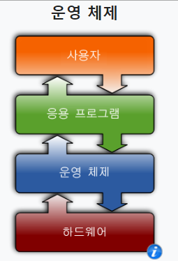
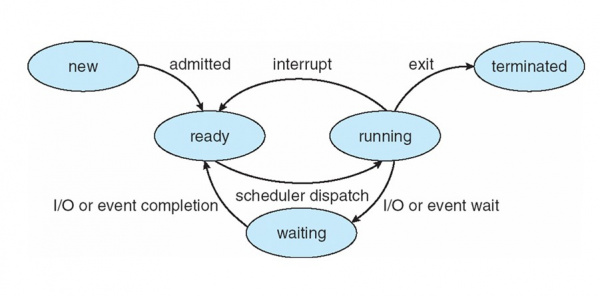
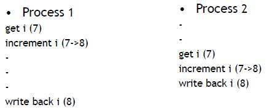

# 05-04 정답

## OS란

 


- OS는 Application과 H/W사이에 존재하며 둘 사이를 관리해주는 역할

- 하드웨어 자원을 효율적으로 관리 - CPU의 개수가 한정적이기 때문
- API를 제공해줘서 하드웨어에 대한 접근을 가능하게 함
- Application은 H/W의 세부사항을 알 필요가 없다.

```
의문) 만약 OS가 없다면?!

- H/W가 바뀌면 Application의 상당부분을 다시 작성해야 한다. (유지보수가 어려움)
- 같은 기능이 여러 Application에 중복 구현되어야 한다. (같은 코드의 반복 사용)
- 숙련된 전문가만이 Application 구현 (기계어를 직접 다뤄야 하기 때문)
```


#### 참고 지식)

```
① Application을 실행하기 위해서는 CPU와 memory가 필요하다.
② O.S는 각 Application에 대해 CPU와 memory 자원을 할당한다.
③ User -> Application -> O.S -> Hard-disk
이 순서대로 저장요청 발생하는데 이 과정을 간단하게 해주는 것이 API이다. 
즉, Application은 Hard-disk에 접근하기 위해서는 API가 필요하다. (요청을 통해 결과를 받아옴)
④ CPU 스케쥴링 : 시간을 쪼개서 1개의 CPU로 여러 Application 동작 시키는 알고리즘
⑤ DRAM이 Main memory이다. 
⑥ 작업관리자에서 현재 사용중인 Application을 확인할 수 있다. (실행중인 프로세서 확인 가능)
```


## 프로세스, 쓰레드

#### 프로세스 정의 : 실행중인 프로그램의 객체이다.

- 실행 중인 프로그램 객체
  - 프로그램의 차이 : 프로그램은 1개이지만 그것을 두 번 실행하면 2개의 process가 생성된다.

- CPU 스케쥴링 단위

- CPU, memory resource 필요 (자원이 할당되어서 프로세스가 실행된다.)

- life time이 존재 (실행과 종료가 존재함)
  - 프로그램은 life time이 없음


#### 프로세스의 상태 :  running, ready, block

```
프로세서의 상태는 3가지이며 현재 실행하고 있는 프로세서는 run 상태, 실행을 기다리고 있는 프로세서는 ready
실행이 중단된 프로세서는 block 상태로 대기한다.
```

 


##### running(실행)

- process가 CPU를 차지하고 실행 중인 상태

- running 개수는 CPU 개수와 같음

  

##### ready(준비)

- CPU를 할당 받을 대상 (CPU 스케쥴링 대상)

- CPU가 할당되면 running이 된다.

- CPU 제외하고는 실행에 필요한 모든 준비가 끝남

- CPU 효율을 높이기 위해 ready상태인 process에게만 CPU를 할당한다.

  - 이유 : block은 이벤트가 발생하기 전까지는 CPU를 쓸 일이 없으므로 이벤트가 발생하면 

    ready 상태가 되어 CPU 할당을 기다린다.

    

##### block(블록) 위 그림에서는 waiting

process가 어떤 이벤트가 발생하기를 기다리며 자진하여 CPU를 반납한 상태 이벤트가 발생 시 ready가 된다.

즉 CPU가 제대로 실행되기 위해서는 (CPU를 할당 받기 위해서는) 현재 사용중인 process와 process state를 알아야 한다. ( 실행하고 있는 것은 run, 실행 중단된 것은 block, 실행 해야할 것은 ready 를 Quere를 통해서 관리)


### 쓰레드 -> 프로세스의 실행 단위

프로세스라는 공간을 할당 받고 실질적으로 작업이 실행될 때 프로세스는 쓰레드라는 단위로 이루어 진다.

(프로세스는 한개 이상의 쓰레드로 이루어져 있다.)


쓰레드가 여러 개라고 한다면 병렬적으로 (동시성) 작업을 진행 할 수 있다. 하지만 이도 멀티 프로세스의 환경처럼

동기화를 항상 고려하며 프로그래밍을 해야한다.


## 문맥교환

위에서 CPU의 개수는 한정적이며 각 CPU가 처리할 수있는 프로그램은 CPU의 개수만큼 가능하다고 하였습니다.

따라서 CPU에 할당되는 프로세스들은 각 상황에 따라서 교체가 되어야 합니다.


##### 즉 문맥교환이란 CPU 할당 교체 기법입니다. (현재 process에서 다른 process로 교체될 때)

- 다른 Task로 CPU를 할당할 때에도 시스템은 반드시 이전 Task의 CPU register values를 기억하고 

   새로운 Task의 CPU register values를 불러내야 한다.

    	( Process를 개념적으로 부르는 용어 : Task )


ARM 프로세서와 X86 체계의 프로세서는 CPU를 이루고 있는 명령어 체계가 다르기 때문에 각기 다른 방법으로 문맥교환이 이루어진다. ( 원리는 동일하지만 CPU의 레지스터를 지칭하는 방법이 다르기 때문 )

원리 : CPU에 프로그램 카운터(PC) 레지스터 Task 내에서 CPU의 자원을 빼앗길 때 실행 코드의 주소 값을 기억한다. 현재 상태의 데이터를 Stack Point에 저장한다.

- 보다 자세한 설명을 듣고 싶다면 개인적으로 연락하시오!

 

## 동기화

    

현재 상황 : Race Condition (Process1 실행 도중에 Process 2가 실행되고 종료, Process 1 종료)

#### Race Condition 이란?

의미 :  여러 프로세스들의 명령어가 동시에 같은 기억장소를 access할 때 그들 사이의 경쟁에 의해 

​			수행결과가 예측된 결과와 다를 때  (발생원인 : 인터럽트, 멀티 프로세싱)

```
즉 코드 실행 중 문맥교환이 발생하면 i가 9가 되어야 하지만, 8이 되는 상황을 막기 위함
즉 동기화란 문맥교환이 발생했을 때 공유 데이터에 대한 접근 권한을 주어서  내부의 연산을 처리하도록 하는 것이다.
```

이를 막기위해서는 여러가지 방법들이 존재 

1. Semaphore

2. Preemption disable

3. Interrupt disable

4. Spin lock... 


#### 대표적인 것 Semaphore

즉 공유 자원을 사용하기 위해서는 현재 Process를 block시키고 다음으로 넘어가되, 공유자원에 대한 권한도 가져가게 끔 만듬 ( 화장실 키로 생각 )


## block I/O, Non block I/O


#### block I/O

Process가 실행될 때 다른 프로세서 작업이 들어오는 경우 Block이 된 상태로 기다리고 들어온 프로세서 작업이 끝난 이후 다시 기존의 코드가 실행되는 것을 상징 ( 문맥교환의 기본적인 상태 )


#### Non block I/O

Process가 실행될 때 다른 프로세서 작업이 들어오는 경우 Block이 되지 않고 들어온 프로세서 작업의 작업이 병렬적으로 이루어지는 경우 ( 단일 쓰레드의 경우 실제로는 block 되는 것이 아니라 빈 값을 던져주는 것으로 이해하면 됨 ) 