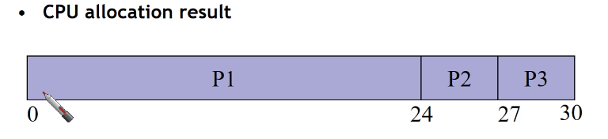
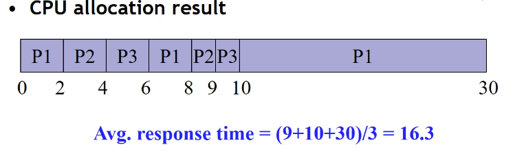

### CPU 스케줄링 이란 무엇인가? 

제한된 CPU를 여러 Process에게 할당하기 위해서 creation, termination과정이 반복되게 됩니다.성능을 올리기 위해서는 해당 과정들이 최대한  짧은 응답시간을 목표해야 합니다. 이러한 평균 응답 시간을 줄이기 위해서는 각 프로세스들의 시간응답을 최대한 효율적으로 작성해야 합니다. 

CPU 스케줄링 시 주의해야할 점)

1. 모든 Process가 CPU를 할당받아야 합니다. 

2. 짧은 평균 응답시간을 가져야 합니다.

### CPU 스케줄링 알고리즘

non-preemeption, preemeption 등 권한차이가 존재하며, 이를 기반으로 FCFS, SJF, RR, Priority based 등이 존재합니다.

### non-preemeption, preemeption의 차이점

non-preemeption : 하나의 프로세스가 CPU에서 동작하고 있을 때 다른 프로세스의 요청이 들어오더라도 할당된 CPU의 자원을 뺏어가지 못한다.

preemeption : 하나의 프로세스가 CPU에서 동작하고 있을 때 더 우선권이 높은 다른 프로세스의 요청이 들어온다면 CPU의 자원을 뺏어간다.

#### FCFS 

정의 : 먼저 ready 상태가 된 프로세스부터 차례대로 CPU가 할당됩니다.

예시 )

    

P1(24), P2(3), P3(3)일 때 

Average Response time = (24+27+30)/3 = 27

#### SJF

정의)  

CPU 실행시간이 짧은 프로세스부터 CPU 할당

Average Response Time을 최적화가능하다. 위의 예시에서는 

( 3 + 6 + 30 ) / 3 = 12

CPU 실행시간이 긴 프로세스의 경우 CPU를 계속해서 할당 받지 못할 수 있다.

각 프로세스의 CPU 실행시간을 예측하기가 쉽지 않다.


#### RR (Round-Robin) -> 유래찾아보면 재밌음

프로세서의 우선순위가 동일하므로 먼저 “ready”상태가 된 프로세스부터 차례대로 CPU할당한다.

CPU를 할당할 때 일정 시간만큼만 할당한다.

할당 시간이 지나면 CPU 빼앗기고 다음 프로세스에게 CPU 할당된다.(Context switch)

짧은 수행시간을 갖는 Process는 짧은 Response Time을 갖는다

긴 수행시간을 갖는 Process는 긴 Response Time을 갖는다

    

### Priority based

프로세스에게 각기 다른 우선순위를 부여하고, 높은 우선순위를 가진 프로세스를 실행한다.

#### Static priority 

우선순위를 한번 부여하면 변경하지 않는 정책

우선순위가 낮은 프로세스는 CPU를 전혀 할당 받지 못할 수 있다. 

따라서 아래의 정책이 고안됨

#### Dynamic priority

우선순위를 동적으로 변경할 수 있는 정책

오랫동안 CPU를 할당 받지 못한 프로세스의 우선순위를 높여 줌으로써 모든 프로세스가 CPU를 받을 수 있게 한다.


### 인터럽트란 무엇인가?

만약 H/W의 이벤트가 발생할 때 (예시 : 키보드 입력, 마우스 클릭 .. 등 ) CPU는 현재 프로세서의 작업을 잠시 중지하고 인터럽트가 처리가 됩니다. 즉 인터럽트란 이벤트가 발생했을 때 그 즉시 현재 작업하고 있는 활동을 멈추고 CPU의 할당을 가지고 올 수 있는 하나의 작업입니다. ( 해당 과정 중에서는 당연스럽게 Context Switching이 발생합니다. )


#### 이러한 인터럽트는 어디서 관리를 하고 있을까?!

ISR (인터럽트 서비스 루틴) 에서 관리하고 있습니다.

위에서의 개념을 완벽하게 이해했다면 결국 인터럽트도 CPU의 자원을 가져가는 하나의 프로세스라고 봐도 무방하다는 것을 알게 됩니다. 이러한 인터럽트는 일반프로세스보다 높은 우선순위를 가지고 있습니다.

인터럽트의 처리 단계 (ARM의 프로세서를 기반으로 설명하겠습니다.)


아래에서 설명하는 ISR의 용어는 이제 인터럽트를 관리해주는 주체라고 이해해주시면 됩니다. 

```
현재 실행되고 있는 할 CPU의 현재 상태의 Context를 저장합니다.
인터럽트 번호를 통해서 해당 ISR의 주소를 PC에서 읽어옵니다.
인터럽트의 처리를 수행합니다.
인터럽트가 종료되는 경우 CPU의 상태를 복원합니다.
```

#### 인터럽트 nesting

인터럽트 또한 여러번 발생할 수 있기 때문에 인터럽트 중 인터럽트 발생을 허용합니다. 즉 더 높은 우선순위의 인터럽트 발생 시 그것을 먼저 처리하는 것을 상징합니다.

nesting은 시스템의 설계자가 설정하는 것이며, 5번이 될 수도 256번이 될 수도 있습니다.

#### 인터럽트 Masking

##### Non-Masking 인터럽트

항상 CPU에서 즉시 처리되는 인터럽트입니다. 위에서 설명한 일반적인 인터럽트의 개념입니다.

##### Masking 인터럽트

인터럽트의 딜레이 설정 및 실행할지 말지 선택할 수 있는 인터럽트

즉 인터럽트가 발생했다고 해서 바로 해당 인터럽트를 수행하는 것이 아니라 잠시 딜레이를 시키고 인터럽트를 수행하는 것을 뜻합니다.

---

#### 인터럽트 관련 주의

1. ISR은 Block 상태가 되면 안됩니다.

​	일반적으로 process보다 높은 우선순위를 인터럽트가 가지게 되어서 우선적으로 실	행하게 되는데 block상태는 사용자의 입력을 기다리고 있는 상태가 됩니다.

​	즉 파이썬을 예시로 들면 인터럽트의 코드가 실행하는중 input 명령어를 사용하면 	시스템 전체가 죽어버립니다.


2. ISR은 짧아야 합니다. 중요한 프로세스가 ISR에 의해서 멈추는 시간이 길어진다면 이는 성능의 하락으로 이어집니다.

​	인터럽트의 시간을 최대한 적게 만들기 위해서의 해결방법으로는 중요도에 따라서 	top half/bottom half로 나뉘게 됩니다.

​	top half는 ISR에서 처리해야 할 중요한 부분을 포함합니다. 

​	(하드웨어관련 작업 및 중요한 작업들 .. )

​	당장 처리해야하는 작업들이 아닌 것을 bottom half라고 불리게 되며, 해당 bottom 	half는 일반적인 프로세스처럼 생성이되며 다른 일반 프로세스와 경쟁하다가 CPU	를 할당받는 경우 처리되게 됩니다.


3. ISR 동작 중에는 같은 종류의 인터럽트를 처리할 수 없습니다.

​	키보드 입력을 처리하고 있는데 다른 키보드 입력 인터럽트가 들어오게 된다면 원하	는 말을 치기가 힘듭니다. (ㄱ ㄴ 을 입력했는데 ㄴ ㄱ 이 입력됨)