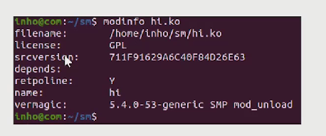

## C언어 복습


## UART 통신의 원리

어떤 방식으로 통신이 이루어지고 있는지 원리에 대한 이해

어렵지 않음 모든 통신의 기초임


통신은 항상 송신, 수신, 프로토콜 3가지가 필요함

UART는 TX, RX, GND로 이루어져 있음 TX는 RX에 연결, RX는 TX에 연결 GND은 GND끼리 연결

GND 기준으로 high Low를 판단하기 때문임


 

USART는 4개임 클럭이 들어감


보드를 받고, ~~센서를 읽어야함

먼지 모르니까 해당 보드의 데이터시트를 본다.

해당 보드와 UART 연결이 되어 있구나~~

이후에 코딩을 짜려고 봤더니 만약에 오픈소스 하드웨어 라이브러리가 존재하는 경우 -> 라이브러리 개발자한테 절해야한다.

라이브러리가 없다면 ? 안됨. 라이브러리를 써도 안되는 경우가 다반사임


결선이 잘못됐던가 센서가 불량인가 .. 다반사로 발생 - > 통신에 대한 이해가 없으면 개발환경이 잘못된 줄 알고 한참 쳐다보게 됨...


송수신이 안될 때 어떻게 대처해야 할까?!

- H/W miss? S/W miss?
  - 회로도가 처음부터 잘못된 것인지?
  - 부품이 불량인지?
  - 소스코드를 잘못짠건지? <- 어떻게 파형이 나가야 맞는건지 정확하게 알고 있어야 한다.
- 송신 check, 수신 check?
  - 송신이 제대로 되고 있는지? 송신이 제대로 되지 않는 다면 수신은 당연히 문제 발생
  - 송신은 제대로 되고 있으나 수신부에서 문제가 있는 경우
  - 받기는 받으나, 데이터가 깨지는지, 아니면 제대로 처리를 못하는건지

- 간헐적 에러 발생
  - 송수신부에 양측에 문제는 없다고 추청되지만
  - 잡음등의 이유로 데이터가 깨지는건지
  - 송수신부 F/W의 문제인지


결국 내가 보낸 데이터가 송신데이터가 맞는지 확인하는 과정을 오실로스코프로 확인해야 한다.


 

통신도 종류가 엄청 많다 -> 원리는 단 하나임

 


직렬통신 vs 병렬통신

직렬통신은 데이터가 1bit(1차선), 병렬통신 : 데이터가 nbit

- 병렬 통신은 보통 8, 16, 32 등을 사용
- 보통 직렬통신보다 병렬통신이 빠름
- 병렬포트 <<< USB 직렬 빠르다.

##### 동기 vs 비동기 : 클럭이 있으면 동기, 없으면 비동기!!


철수가 0100 0001을 보내는 경우 영희는 모른다.

why : 0과1의 변화는 알지만 0이 몇개인지 즉 시간의 흐름을 모르기 때문임

시간의 흐름을 알 수 있게 하는 clk를 같이 보내줌 

즉 clk도 신호를 연결시켜줘야함

clk를 보내주는게 동기통신이다.

동기통신의 예시 ) I2C, SPI


비동기는 클럭이 없음

클럭이 없다면 무엇에 맞추어 데이터를 보낼까?!

(비동기를 동기화 시키는 방법)

양측이 협의를 하여 서로 1초마다 데이터를 확인함 -> 이런 식으로 동기화가 됨!

비동기통신의 예시) USART

-> 이렇게 1초마다 데이터를 확인하는 것을 baudrate라고 함bps (bit per sec)


UART는 데이터를 어떻게 보낼까

MSB LSB를 뒤집에서 보낸다.

 

IDLE일 때 1이고, 

parity bit : CRC와 더불어서 오류 체크 기능임 

1101 0110 odd : parity -> 0

1101 0110 짝수 : parity-> 1

데이터가 짝수개가 깨지면 -> 의미가 없음 잘안씀 !!(그래서 안쓴다)


짝수 : 1의 개수를 짝수로 맞춰라 

홀수 : 1의 개수를 홀수로 맞춰라 


USART, UART 둘 중에 뭐가 맞는 것일까

UART는 비동기, USART는  


 

IDEL일 때 1이고 Start bit와 Stop bit를 보내서 해결한다.


```
문제 예시)
115200-8-N-1 (1)
통신속도 115200bps, 데이터비트 : 8bit, parity bit는 쓰지 않겠다. stop bit는 1bit
9600-9-E-2 (2)
...


9600으로 설정되어있으면 한비트의 시간 1/9600
```


## 디바이스 공부(MCU) 

STM32를 배울 것이고, 컴파일러는 STMCubeIDE를 사용할 예정임

IDE환경과 컴파일러를 한번에 제공해주는 툴임


임베디드는 보드 초기세팅이 매우 어려움(Startup.s 코드 작성/ Clock 설정/ 레지스터 설정 등)

- 경험많은 팀장급 엔지니어가 초기세팅을 진행을 하지만, CubeIDE가 이를 대신해줌
- GUI로 설정하면, 시작 코드를 생성해줌


## BSP업체


#### 임베디드계 SI업체 고객이 필요한 보드를 만들어달라

SOC 칩을 포함한 내부 기판을 제작함


점프케이블 구멍도 만들고 여러가지 칩을 호환하고 USB를 꽃을 수 있는 물리적 소켓준비함 등 보드 제작-회로작성

BSP업체는 SOC업체에서 만든 리눅스 코드, 드라이버코드, 샘플 코드를 보드제작업체에 준다. 

BSP업체는 하드웨어를 만들고 샘플코드를 받아와서 코드를 수정 혹은 드라이버를 추가 개발한다.


결국 디바이스 드라이버를 개발하기위해서는 커널 빌드를 해두어야 한다 -> 결국 디바이스드라이버 개발하려고 커널을빌드한다.


운영체제가 메모리가 존재함 (0xA) - GPIO 매핑 -> 모터를 달아놈

Firmware 짤때는 uint_8_t *p = 0xA

*p = 1;

*p = 0;

이렇게 건들임


규모가 큰 OS는 메모리를 직접 건드리는 것을 금지하고 있습니다.

무조건 시스템 콜을 사용해서 사용해야합니다.


커널은 권한이 가능하다. 그래서 커널을 직접 수정해서 커널에 소스코드를 집어놓고, 빌드 후 실행하면 동작한다.

커널에 소스코드를 집어놓고 빌드 후 실행하면 잘 실행된다. 빌드하는데 하루가 걸린다.


소스코드를 수정하고 테스트하면 한번 테스트 하는데 시간이 너무 오래걸려서 개발 불가능...

항상 퇴근 전 빌드 걸기가 예전에는 그랬음!!


어플개발하는데 메모리도 못건들임

따라서 커널 모듈이라는 것이 생김 이후 테스트가 가능하다.

따라서 지금 실행중인 커널에다가 필요한 부분의 커널 모듈을 넣는다. 


커널에 들어가는 코드 덩어리를 만듬 이녀석만 빌드를 해서 모듈만 빌드함

app이 커널모듈을 건들여서 커널이 동작하는 구조로 이루어져 있음

디바이스 드라이버라는 것은 커널안에서  디바이스 장치를 제어하는 소프트 웨어이다.


결국 디바이스 드라이버를 개발하기 위해서는 

1. 커널 모듈을 먼저 만들 것이고 (디바이스 드라이버가 커널 모듈의 형태이다?)
2. 이 것을 커널에 넣고,  어플리케이션이 커널 모듈을 실행시키고

3. 커널 모듈이 장치를 제어하게끔 만듭니다.


커널 모듈을 빌드하려면 커널 코드가 필요하다.(커널 소스코드)

커널 모듈을 빌드할 때 여러가지 파일이 만들어지는데 이러한 파일을 참고해야지 커널 모듈을 개발가능하다.

1. 커널 빌드
2. 커널 모듈 개념 살피고, 커널 모듈 만들기
3. app - D.D 개념, 만들기


커널 빌드를 하는것은 라즈베리파이 홈페이지에 나와있음

빌드 (보드 개발자라면 k-config를 통해서 옵션을 살짝 바꾼다음 개발할 수도 있음)

커널 빌드까지함

커널 모듈


# Device Driver  개발시 필요한 것

- Kerel Header가 필요

  리눅스라는 것은 Application 권한이 있고 커널권한이 있습니다. 만약 커널권한으로 코드를짜고 싶으면 시스템 콜을 사용해야함

  또한 memory 접근이 불가능 

  

​	우리는 커널 모듈을 하나 만들어서 여기다가넣어서 동작시킬 것이다. 커널모듈은 메모리 접근이 가능하다. 커널 모듈을 코드를 작성하고 빌드한다. 이 커널 모듈은 내부적으로 함수를 호출한다 이러한 함수를 호출하기 위해서는 헤더가 필요하다  만드러진 커널모듈을 커널안에 넣기 그리고 동작시킨다.

Device Driver가 필요하다 개념적인 한 문장으로 Device Dricer를 이해하기 힘들다. 이것이 필요했던 스토리를 알아야지 디바이스드라이버의 정의를 

사전적인 Device Driver 정의 : Program이 HW를 제어하기 위한 SW를 뜻함 

Software interface를 통해 Application이 HW Spec을 이해하지 않아도 되는 장점

- 이해 어려움 위의 스토리를 참고해야지 디바이스 드라이버가 이해 가능


결국 DD를 사용해서 하드웨어를 제어해야 하는 이유

1. app에서 금지되어 있기때문 반드시 커널에서 해야함

2. 따라서 커널에 커널 모듈을 넣고 app을 따로 만들어서 

   

해당 app 커널 모듈을 동작시키도록 만들것임 

해당 source 코드는 하드웨어를 제어하는 방식이다.

1. 커널모듈 (커널 모듈 형식의 디바이스 드라이버를 만듬 )
2. app (D.D에 신호를 보내는 app을 만들 것임)
3. 쉘을 통해서 app을 실행시킴 해당 app이 커널 모듈을 실행시킴 해당 모듈이 하드웨어를 제어함


디바이스 드라이버 자체가 없다면 ?  펌웨어에서 가정

HW를 사용하는 여러개의 펌웨어를 개발했는데 하드웨어가 바뀌는 경우 전부 펌웨어를 수정해야한다.

이렇게 중간 레이어(드라이버)가 있다면 레이어만 바꾸면 됨


Application과 HW 사이에 계층을 두었음

App은 커널의 API(System Call)을 통해 H/W 접근이 가능하다.

HW에 대한 지식이 없어도, 커널 API를 통해 H/W 제어하는 Application 제작 가능


#### ---커널 빌드가 이제 다된 상황을 가정---

``` 
mkdir work1
cd work1/
vi km.c # 커널 모듈


main함수가 없다. 왜냐하면 돌아가는 커널함수에 꼽사리를 껴야하기 때문에!
#include <linux/module.h>

MODULE_LICESE("GPL");
static int hi_init(void)
{
	printk(KERN_INFO "OK HELLO KFC\n")
	return 0;
}

static void hi_exit(void)
{
	printk( KERN_INFO "BYE BYE\n\n");
}

module_init(hi_init);
module_exit(hi_exit);
```


####  Makefile 만들기

```
cd modules
uname -r # 5.15.36-v71+ # 모듈 헤더가 존재함
cd 5.15.35-v71+ # bulid라는 파일이 존재함
```

```
#makefile

KERNEL_HEADERS=/lib/modules/$(shell uname -r)/build
// KERNEL_SRC=/usr/src/linux 같은 말임

obj-m := hi.o

go:
	make -C $(KERNEL_HEADERS) M=$(PWD) modules
	//make -C $(KERNEL_SRC) M=$(PWD) modules

```

```
make를 하였을때 km.ko가 생김(커널오브젝트)
```

dmesg하고 enter를 했을 때 커널 로그가 나옴


#### 커널 모듈을 커널에 적재하는 방법

Device Driver를 Build 후 생성되는 파일 ko (커널 오브젝트)

ex) min.ko

insmod : 커널에 커널 모듈이 들어가면서 커널과 같이 맞물려서 동작됨

```
sudo insmod km.ko (insert module)

```

커널이라고 하는 거대한 톱니바퀴에 많은 app들이 맞물려서 돌아가고 있었는데

커널 모듈이 추가되어서 들어가게 됨

```
sudo rmmod km (remove module)
```

커널 모듈이 삭제되는 과정


##### 원래는 디바이스 트리에 정보를 넣어줘야하지만 우선 넘어감 (생략)


#### Source Code 분석

```
printk( KERN_INFO "OK HELLO KFC\n" );

KERN_INFO : 레벨 우측의 문구의 출력을 더 올려줌

커널로그옵션도 있어서 특정레벨이상만 보여주겠다 이런 옵션도 있음
한 일곱가지 종류가 존재함

module_init(km_init) : 커널에 존재하는 매크로 (모듈화를 해놓음)

단순 app.c 파일로 hw레벨에 접근이 불가능하기 때문에
모듈을 사용하여 HW레벨에 접근하는 것임을 꼭 암기

```

전체적인 정리

app.c파일에서는 하드웨어 레벨에 접근이 불가능하게 되어 있음(리눅스 내부)
그래서 커널 모듈이라고 하는 것을 insmod를 통해서  커널 내부에 넣어줌

커널모듈은 커널 내부에서 동작하기 때문에 하드웨어 제어가 가능함

커널모듈을 빌드하기 위해서는 커널 코드가 필요함


1을입력 : LED ON

2를 입력 : LED OFF 이라는 프로그램을 만든다고 가정

이 것을 쉘에 개발하면 안됨 ( 쉘은 어플리케이션 레벨이기 때문 )

따라서 app을 만들고 필요한 경우 커널에 신호를 보냄(LED 켜줘)

커널모듈이 받아서 하드웨어를 제어해줌


커널 내부에 디바이스 파일을 만들고 커널 모듈(ko파일)과 연결합니다 

app.c 에서 디바이스파일을 open(" kfc", ... ) # Open System Call//

write(1) write(0)을 사용한다. 이렇게 앱을 코딩한다.

 

리눅스에서 HW를 제어하기 위해 따라야만 하는 구조... 임


디바이스 드라이버. 이런 구조에 맞게 개발하는 것은 하드웨어 제어하는 하나의 플렛폼임

이러한 구조로 만들어야지 리눅스에서 하드웨어 제어하는 프로그램을 만들 수 있다.

 

여기 보이는 그림이 정리된 그림

오른쪽에서 부터 만들 것임

1. Device Driver
2. Device Files
3. Application

3가지를 만들어야지 LED를 킬 수 있다.


회사에서는 어떻게 하나

Application 개발자

- HW를 제어할 수 있는 API 사용 방법 익히기
- API가 건내준 Data 처리
- API를 이용하여 HW제어
- Log 남기기
- Network/UI 작업

Device Driver 개발자

- HW 제어 API 제작
- HW 불량 분석
- Latency 측정

(쉽게 말해 Device Driver는 Device Files 과 Device Driver를 개발하는 분)

Application 개발자는 드라이버만드신 분들의 함수를 가지고 Application을 개발하곤 합니다.


타OS에서 Device Driver 개발

Windows : Windows Driver Kit(WDK) 사용하여 개발

MacOS : I/O Kit Framework를 사용하여 개발

 


##### 질문 ) 커널 모듈과 디바이스 드라이버의 차이

 커널 모듈은 커널 내부에 들어가는 모듈를 뜻하고

디바이스 드라이버는 하드웨어를 제어하는 소프트웨어를 뜻함

통상적으로 디바이스 드라이버라고 하는 것은 HW를 제어하는 커널모듈입니다.

따라서 방금만든것은 커널모듈이면서 디바이스드라이버가 맞음


보통 창을 두개 쓰고 

창 하나는 dmesg -w : 계속 모니터링 됨

창 하나는 insmod rmmod를 하면서 실시간으로 로그기록을 볼 수 있음 (잘 되고 있는지 확인가능)


Device Dricer는 커널 내부에서 동작한다.


커널 모듈이 없다면 ?!...

커널 소스에 GPIO on off하는 동작 코드가 존재한다. 이 것을 빌드 1시간하고 런해야한다.

큰 단위로 빌드하기 모단 모듈을 만들어서 모듈 단위로 빌드를 시키는 방법임

커널은 계속 RUN 상태고 꺼지지 않음 - 모듈만 끼웠다 제외함


insmod는 커널버전이 맞아야함 커널 버전이 맞지 않을 경우 에러가 남


Device Driver 는 Application Makefile보다 규칙이 엄격하다.

다음과 같이 Makefile을 만들자

- target 밑에 들여쓰기는 반드시 "TAB"으로 한다.

 

make file에 clean을 추가하고

디바이스 드라이버를 만들 때는 clean 하고 make하고 다시 clean하고 make하는 것이 권장된다

(갱신이 잘 안될때가 많음)


hi.c 파일을 작성

 

MODULE_AUTHOR("minco");

MODULE_DESCRIPTION("My Device Driver"); 

이 부분은 디바이스 드라이버를 작성할 때 추가적인 정보를 작성하는 곳

현재 드라이버의 작성자와 설명을 해놓음

#### 왜 주석을 사용하지 않았을까

modinfo hi.ko 를 입력하는 경우 

모듈에 대한 정보를 확인할 수 있음

 


##### lsmod를 입력하는 경우 커널 내부에 있는 모듈 리스트 들이 나옴


### Device driver 종류(암기!!!)

##### chrdev : Byte 단위로 값 전달, 일반적인 임베디드 장치에 사용

blkdev : 블록 디바이스 드라이버, kb 이상의 '블록' 단위로 값을 전달, 

##### Disk 장치에 사용되는 디바이스 드라이버(한번에 데이터를 많이 보내는 경우)

netdev : 네트워크 디바이스 드라이버, socket을 열고 ioctl 이라는 System Call로 장치를 제어


### Device Node

Device Node는 Device File과 동일한 말임

device 파일은 /dev에 존재함

 

##### 제일 처음에 나와있는  b와 c가 각각 block device와 char device를 뜻함

Device Files라고 불리지만 명령어가 Device Node이므로 Node라고 칭할 것임

```
디바이스 파일에는 고유 ID가 존재한다. Major Number Minor Number 
```

Major Number 와 Minor 번호를 조합하여 해당 장치 드라이버의 고유번호를 만든다.

Process도 ID가 존재하는데 PID라고 불림

이것은 Device Driver 개발자가 마음대로 지정하는 번호임


디바이스 파일을 만들기 위해서는 mknod라는 것을 사용함

node가 디바이스 파일과 같으므로 mknod를 치면 나오게 됨

```
sudo mknod .kfc c 100 200

kfc라고 하는 장치를 만듬
이후에 app에서 go() 라고하는 함수를 입력하면 mknod에게 명령어를 날리고
mknod가 go()라고 하는 함수를 호출해서 HW를 제어하게 된다.
```


#### Application

System Call을 사용한 Application을 만듬


 

이러한 시스템 콜을 쓸 것임

```
#vi app.c

#include <stdio.h>
#include <sys/types.h>
#include <sys/stat.h>
#include <fcntl.h>
#include <unisted.h>

int main()
{
	printf("OPEN FILE!!\n");
	int fd = open("kfc", O_RDONLY);
	close(fd);
	printf("CLOSE FILE!!\n");
	return 0;
}


이후
gcc ./app.c -o ./app 을 치면 object파일까지 한번에 실행됨
--출력--
OPEN FILE!!
CLOSE FILE!!
```


#### static 메서드

- file 내에서만 쓸 수 있는 함수
- Driver는 c파일 끼리 함수이름 충돌방지를 위해 static 함수 사용을 권장
- Driver에서 연결되는 함수 이름은 "모듈명_xxxx" 을 권장한다.


  

 

- #### Nobrand driver file을 OPEN 한다.


다시 설명

```
### 노드만들기 + 권한설정

# 노드만들때 경로는 /dev에 설정한다.
# 드라이버 파일 설정
sudo mknod /dev/nobrand c 100 0
sudo chmod 666 /dev/nobrand


### 앱 만들기
vi app.c
-- 내용 --
  1 #include <stdio.h>
  2 #include <sys/types.h>
  3 #include <sys/stat.h>
  4 #include <unistd.h>
  5 
  6 int main()
  7 {
  8     printf("OPEN FILE!!\n"); // 앱을 실행시는 경우 발생 -> printf과정이고
  9     inf fd = open("/dev/nobrand", O_RDONLY);  // 현재 커널내부에 nobrand 모듈이 존재한다면!! -> 로그기록이 남음
 10     if (if == -1)
 11     {
 12         printf("FILE OPEN ERROR!!!\n");
 13     }
 14 
 15     printf("CLOSE FILE!!\n");
 16     close(fd);
 17 
 18     return 0;
 19 }


## 리눅스 드라이버 기본 파일 생성 # 모듈 설정

## 해당 파일의 내용으로 인해서 디바이스 노드파일과 디바이스 드라이버 파일을 연결시킨다
- register_chrdev, unregister_chrdev를 이용하여 연결시킨다. 


 vi nobrand.c
 
  1 #include <linux/module.h>
  2 
  3 MODULE_LICENSE("GPL");
  4 
  5 static int km_init(void){
  6     printk( KERN_INFO "OK HELLO Nobrand\n");
  7     return 0;
  8 }
  9 
 10 static void km_exit(void) {
 11     printk( KERN_IMFO "BYE BYE\n\n");
 12 }
 13 
 14 module_init(km_init);
 15 module_exit(km_exit);
 16 


## Make file
  1 KERNEL_SRC=/usr/scr/linux # 경로 각자에 맞게 수정 커널 build 한곳
  2 obj-m:=nobrand.o
  3 
  4 go:
  5     make -C $(KERNEL_SRC) M=$(PWD) modules
  6 
  7 clean:
  8     make -C $(KENEL_SRC) M=$(PWD) clean
  9 

make -> make를 하고나면 nobrand.ko 파일이 생김

sudo insmod ./nobrand.ko
sudo rmmod nobrand

```

```
  1 #include <linux/module.h>
  2 
  3 #define NOD_NAME "nobrand"
  4 #define NOD_MAJOR 100
  5 
  6 MODULE_LICENSE("GPL");
  7 
  8 static int nobrand_open(struct inode *inode, struct file *filp ){
  9     printk( KERN_INFO "OPEN!!\n" );
 10     return 0;
 11 }
 12 
 13 static int nobrand_release(struct indo *inode, struct file *filp){
 14     printk( KERN_INFO "CLOSE!!!\n");
 15     return 0;
 16 }
 17 
 18 static struct file_operations fops = {
 19     .open = nobrand_open,
 20     .release = nobrand.release
 21 };
 22 
 23 // insmod 할 경우 실행되는 함수(init)
 24 static int nobrand_init(void){ 
 25     printk( KERN_INFO "OK HELLO Nobrand\n");
 26     if (register_chrdev(NOD_MAJOR, NOD_NAME, &fops)){
 27         printk(KERN_INFO "ERROR!! register error\n");
 28     }
 29     return 0;
 30 }
 31 // rmmod 할 경우 실행되는 함수(exit)
 32 static void nobrand_exit(void) {
 33     unregister_chrdev(NOD_MAJOR, NOD_NAME)
 34     printk( KERN_IMFO "BYE BYE\n\n");
 35 }
 36 
 37 module_init(nobrand_init);
 38 module_exit(nobrand_exit);
 39 

```


---

커널빌드 디바이스 드라이버 설치 및 GPIO 제어까지 해야함


System Call의 종류


System Call의 특징

```
Interrupt 방식으로 System Call이 동작한다.
1. libc에 구현되어 있음
2. System Call Number를 레지스터(R0 ~ Rn)에 값을 넣고 SWI 수행
3. SWI로 인해 CPU보드가 User Mode -> Kernel Mode로 전환 됨
4. ISR 에서 System Call Number를 확인하여 매칭되는 함수를 호출
5. 해당 함수가 작업이 끝나면, User모드로 돌아감
6. 스케줄러에 의해 다시 작업을 이어서 수행
```


Makefile 수정

기존 Make file에 C언어 빌드도 추가

```
KERNEL_HEADERS=/lib/modules/$shell uname -r)/build
CC = gcc

TARGET := app
obj-m := nobrand.o

all:driver app # 두개의 태그를 준비하고 빌드한 것

driver:
	make -C $(KERNEL_HEADERS) M=$(PWD) modules

app:
	$(CC) -o $@ $@.c

clean:
	make -C $(KERNEL_HEADERS) M=$(PWD) 
	clean rm -f *.o $(TARGET)
	
make all : 전체 빌드
make driver : 드라이버 빌드
make app : app 빌드
make clean : 드라이버 + app 모두 제거
```

참고 ) make라고만 치면 첫번째 태그가 실행된다


```
편리한 개발을 위한 세팅
alias.sh 파일을 생성 후 실행
sd : rmmod
sc : insmod
sh 실행
  - sudo chmod +x ./alias.sh
  -	./alish.sh
```

shell Script 실행 방법 :  ./alish.sh or source ./alias.sh 으로 실행


```
ioctl은 만능이다. ( input output control ) - read write 만능이다.

개발자들이 간단하게 개발할 때는 ioctl을 사용한다.

read write 언제쓰냐. 목적을 좀 더 명확하게 사용할 때 - chr dev를 만들 때!

디바이스 드라이버를 개발할 때는 반드시 알아야 할 3가지 read write ioctl
```


App에 read / write SystemCall

```
#app example

#include <stdio.h>
#include <fcntl.h>
#include <sys/types.h>
#include <sys/stat.h>
#include <unistd.h>


int main()
{
	int fd = open("/dev/nobrand", O_RDWR);
	if (fd <0) printf("ERROR\n");
	
	// write 7 char
	write(fd, "KFC JJANG\n", 7)
	// 7이라는 것은 size이다. 드라이버 내부에서는 size_t의 값으로 들어가서
	해당 size_t의 count를 활용한다면 잘 동작할 것이다.
	
	//read char
	char buf[100];
	read(fd, buf, 100);
	printf("%s\n", buf);
	printf("%s\n", buf);
	
	close(fd);
	return 0;
}

Byte 단위로 값을 보내고, 받을 때 write read 함수를 사용
- write(fd, 메시지, 사이즈)
- read(fd, buf, buf 사이즈)
( 시스템 프로그램 시간에 배웠던 내용 )
```


드라이버에 read와 wrtie를 추가한다.


```
# 드라이버 내부

static ssize_t nobrand_read(struct file *filp, char *buf, size_t count, loff_t *ppos){
	buf[0] = 'H';
	buf[1] = 'I';
	buf[2] = '\0';
	return count;
}

// ssize_t : read에 성공한게 몇개인지 리턴해준다.

static ssize_t nobrand_write(struct file *filp, const char *buf, size_t count, loff_t *ppos){
	printk ( KERN_INFO "app message : %s\n", buf )
	return count
}


static struct file_operations fops = {
	.open = nobrand_open,
	.release = nobrand_release,
	.read = nobrand_read,
	.write = nobrand_write
}


```


```
ioctl과 read, write의 가장 큰 차이

R, W = 장문의 데이터를 전달 or 받을 수 있음

ioctl = 기본적으로 값 하나 보낼 수 있음
만약 장문의 데이터를 통신하고 싶다면
copy_from_user( ) 와 같은 따로 커널 함수를 추가로 작성 
```


---

### ioctl에 관하여

ioctl을 이용하여 여러가지 옵션을 줄 수 있음

- App에서 CMD에 정수 값을 보냄
- 드라이버에서 CMD 값에 따라 select 문으로 분기를 태움
- CMD값에 따른 코드 추가 가능
- args에 포인터를 전달하여 App의 다량의 데이터를 Driver로 전달 가능

 

application level에서는 이렇게 호출함

```
ret = ioctl (fd, CMD, &args);
```

CMD에는 전달해주고 싶은 하나의 4바이트짜리 값을 전달함 

추가로 데이터를 보내고 싶을 때 args 로 쓴다. 아직 먼말인지 모르겠음 

결국 명령어와 주소값을 보내는 것임

- 이런식으로 read와 write를 보내는 것이 가능하고 이걸로 3번 신호 ! 5번 신호! 등 신호 값만 보낼 수도 있음

```
# Application

#include <stdio.h>
#include <fcntl.h>
#include <unistd.h>
#include <ioctl.h>

int main()
{
	int fd = open("/dev/nobrand", O_RDWR);
	if (fd <0) printf("ERROR\n");
	
	//ioctl 
	// 참고로 0, 1, 2는 예약이 되어 있음
	// 3, 4, 5 이렇게 쓰면 안되고 매크로 함수로 써야함!!
	ioctl(fd, 3, 0);
	ioctl(fd, 4, 0);
	ioctl(fd, 5, 0);
	
	close(fd);
}
```


```


# 드라이버 내부

static ssize_t nobrand_read(struct file *filp, char *buf, size_t count, loff_t *ppos){
	buf[0] = 'H';
	buf[1] = 'I';
	buf[2] = '\0';
	return count;
}

// ssize_t : read에 성공한게 몇개인지 리턴해준다.

static ssize_t nobrand_write(struct file *filp, const char *buf, size_t count, loff_t *ppos){
	printk ( KERN_INFO "app message : %s\n", buf )
	return count
}

static long nobrand_ioctl(struct file *filp, unsigned int cmd, unsigned long arg){
	printk( KERN_ARLERT "%d\n, cmd);
	
}


static struct file_operations fops = {
	.open = nobrand_open,
	.release = nobrand_release,
	.read = nobrand_read,
	.write = nobrand_write
	.unlock_ioctl = nobrand_ioctl 
}


```


참고) Bulid 환경

Native 환경 개발이 편리한 경우 (개발할 장치(임베디드 장치)에서 코딩하는 것 -> OS가 올라가 있음 ) -> 일반적인 

- Device Driver
- Application


개발 PC 개발 후 Cross Compile이 편리한 경우 -> 고성능 PC에 개발, 빌드 실행파일을 만들고 타겟보드로 옮겨서 개발하는 것임  (Default) 값

- Linux Kernel 개발
- 규모가 큰 Device Driver / App 개발시


## 데이터시트 분석

결국 하드웨어를 제어하기 위해서는 데이터시트를 분석해야 한다.

Raspberry Pi Hardware

rasberrypi.com -> Documentation -> RaspberryPi Datasheets -> Chip 정보확인 -> pdf 데이터 시트 확인


BCM2711 ARM Peripherals

Peripheral :  (CPU와 메모리 외 기타등등 ..)

```
```

Address map이 엄청 중요하다!

Address map이 3단계로 구분되어서 나옴 

 


32비트 시절에 4기가 이상 메모리를 사용하기 위해 확장된 32비트 형태의 ARM 기능이 추가됨 -> 지금은 64비트와 32비트만 사용함 (거의)


Adress Map이 3가지

건들이고 싶은 것은 GPIO이며, Main peripherals 에 존재합니다.

코어가 두개가 달려있음 -> GPU 컨트롤러와, CPU 코어가 동시에 표현됨 따라서 RAM도 GPU(VC)를 위한 RAM과 ARM코어를 위한 RAM이 존재함


일반적인 Memory Adrress는 32bit를 사용함

32bit System 에서 4GB이상 메모리가 사용됨  : 32bit -> 0xFFFF FFFF -> GB단위 1024^3 이므로 4가 나옴


32bit System에서 4GB 이상 메모리 사용을 위한 노력

- ARM 의 "LPAE" 기능
  - Large Physical Address Extension
  - 더 큰 메모리를 사용할 수 있도록 BCM2711은 35bit 주소 체계를 사용한다.
  - 35bit로 사용할 수 있는 최대 메모리 용량 : 약 32GB 메모리

 

데이터 시트는 왼쪽을 기준으로 문서가 작성되어 있지만, 커널 빌드는 오른쪽을 기준으로 작성되어 있음

 


결론 : 왼쪽에 Main peripherals를 건들이고 싶으면 -> 오른쪽의 0x0_FC00_000C를 건들이면 된다.  


이건 라즈베리 한정이며, 일반적인 임베디드는 이렇게 복잡하게 되어 있지않음

 


```
정리 : 데이터시트에는 Legacy Master View
기준으로 주소가 표현되어 있음
2. 현재 라즈베리파이는 LPAE 라는 기능이 켜져있음
3. LPAE 라는 기능을 쓰면 주소 체계가 35bit Address Map (Low Peri Mode) 기준으로 주소를 사용하면 됨 (라즈베리파이 한정)

-----------------------------------
결론 : C언어로 0x0_FC00_0100을 건들이면 된다고 나와 있다면, 0x0_FC00_0100을 건드리면 된다!! -> LPAE 때문!!
```


### GPIO 연결을 할 예정

  

이건 하드웨어 관련된 내용이므로 생략해도 상관없음


#### 5.2 Register View를 집중해서 봐야함

 

참고 ) 0x7e20 0000 중에서 e는 에코라고 부름, 4개씩 끈어서 읽어야 함


base address : 0x7e20 0000으로 나와있음

SW개발자는 어느 address를 건드려야 할까요!

-> Offset  = 얼마나 떨어져 있는가를 뜻함 

 

BASE 주소의 OFFSET값을 다시 정하고 220 0000을 더해야한다. -> 0X0_FC00_0000 + 220 0000 을 하면 BASE주소가 나오게 됨


 

Bits : 3개의 비트를 사용하는 것이고, 이름, 설명(000 인경우 인풋값으로 사용, 001인 경우 output값으로 사용한다.) 라는 정보

takes alternate function 0 같은 것들은 하드웨어 담당자가 무언가 기능을 만들어주는 것임


 

```
문제)
몇번 레지스터의 몇번 비트를 건드려야 할까요 ?

GPFSEL1 Register에 24에서 26번 비트를 건드려야 한다
(아래 그림 참고) 또한 001을 넣어야 한다(아웃풋 설정이기 때문)

정확히 0x???????을 건드려야 할까요?
base : 0x7E20 0000 ----> (0xFe20 0000)
offset : 0x04     -----> (0xFE20 0004)
```


 


base : 0x7E20 0000 ----> (0xFe20 0000)

 

offset : 0x04            -----> (0xFE20 0004)

-> gpfsel1의 값은 0x04입니다.


이렇게만 해서 끝나는 것이 아니라, SET과 CLEAR 과정이 남아 있음

  

GPIO SELECT가 존재하고 GPSET이 존재, GPCLRO 존재

output으로 설정하고 set하면 led가 켜질 예정

 

0번부터 31번 비트까지는 GPSET0를 건들임

32번부터 57번 비트까지는 GPSET1을 건들임


18번 GPIO를 set하고 싶으면 GPSET0를 건들임

위에 그림에서 보면 GPSET0의 offset은 0x1c임


```
[18번 핀 Output] GPFSEL1
0xFE20 0004의 26:24 에다가 001 넣기
[18번 핀 Set] GPSET0
0xFE20 001C의 18번 bit에다가 1 세팅
[18번핀 Clear] GPCLR0
0xFE20 0028의 18번 bit에다가 1세팅 = LED OFF
```


Clear도 동일한 과정임


---

## 개발 ##

전역 변수들 생성

ioremap 을 사용하여 커널에서 HW 메모리에 접근 가능

( ioremap이란? 커널에서만 쓸 수 있는 함수임 )

- 물리메모리 -> Kernel Space 메모리에 mapping
- BASE를 출력하면, Kernel Space 어디에 Mapping 했는지 알 수 있음

ioremap API를 쓰기 위한, 헤더 파일 asm/io.h 추가


 

LED 키고 끄기


```
만약 17번 GPIO를 사용할 경우,
*GPFSEL1 $= ~(0x7 << 21);
*GPFSEL1 $= ~(1 << 21);

*GPSET0 = (1<<17);
```


드라이버는 복잡한 함수가 들어가면 안되고, 간단 명료해야함 소스코드는 반드시 어플리케이션 레벨에서 구현해야 함 (while 도 금지임)

( 무한 반복 숙달 연습해야함 ) -> 정말 중요한 내용

---


Read 함수를 통한 버튼 인식 !! 도움없이 직접 개발해야함


#### ioctl을 사용할 때 기존 3, 4를 적으면 안된다고 했었음

이유 : cmd은 32bit로 구성되어 있기 때문

약속된 cmd 변수의 비트 단위 Format이 (32bit)

- Direction : R / W
- Size : 데이터 크기
- Type : 매직넘버
- Number : 구분번호

 


원래는 이렇게 32비트 단위로 보내야하지만, 쉽게 Format을 사용하기 위한 Kernel이 제공하는 Macro함수가 존재함

- _IO(type, number)
- _IOR(type, number, 전송받을 데이터 타입)
- _IOW(type, number, 전송보낼 데이터 타입)
- _IOWR(type, number, 전송 주고받을 데이터 타입)

결론 ioctl을 사용할 경우 규칙을 지켜야하므로 매크로 함수를 사용해서 기입해야 한다.

- app이나 driver 개발 전부 포함 해서 매크로 함수를 사용해야함

